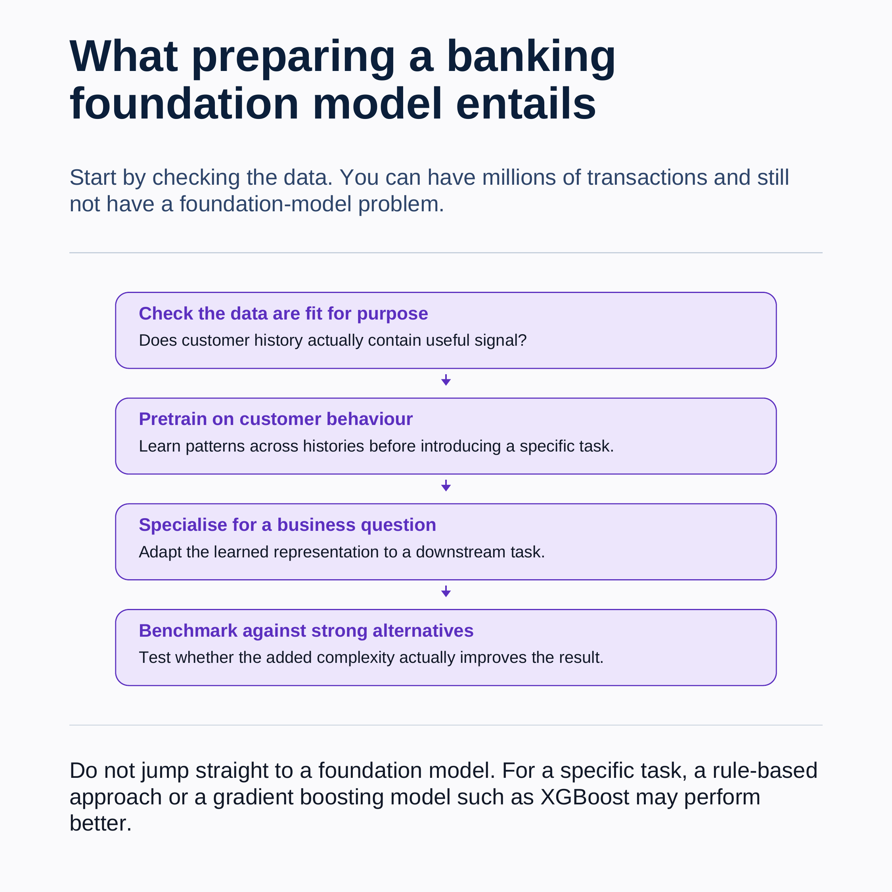
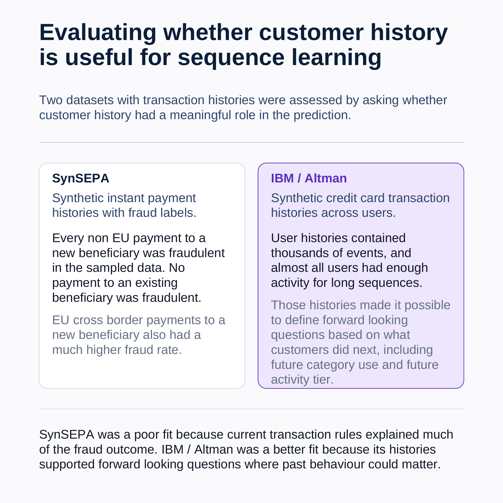
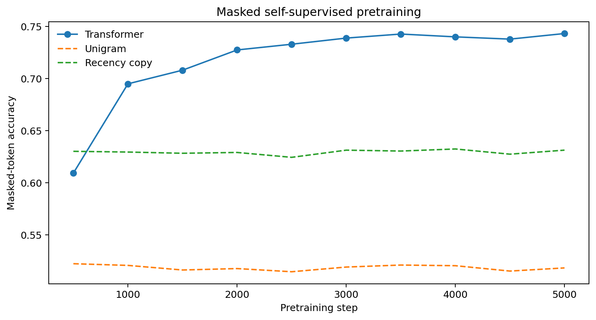
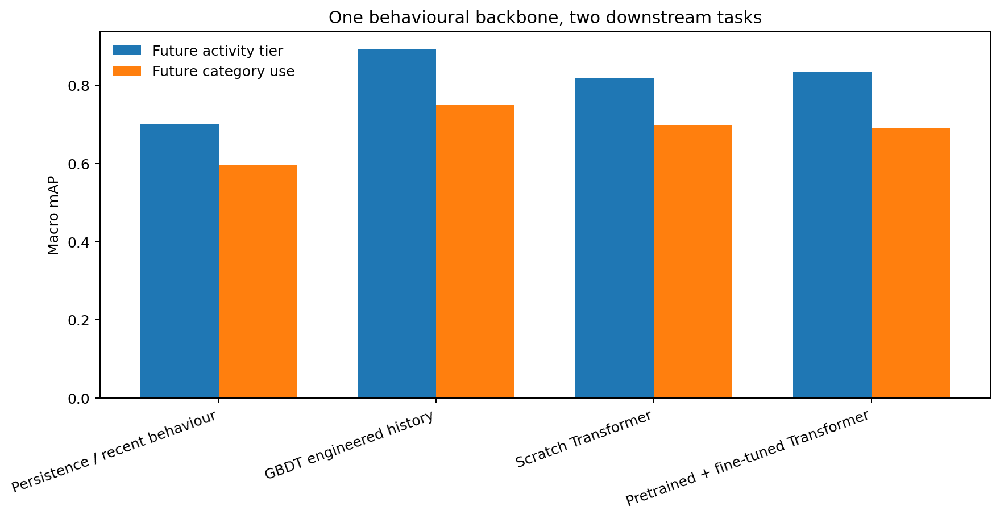
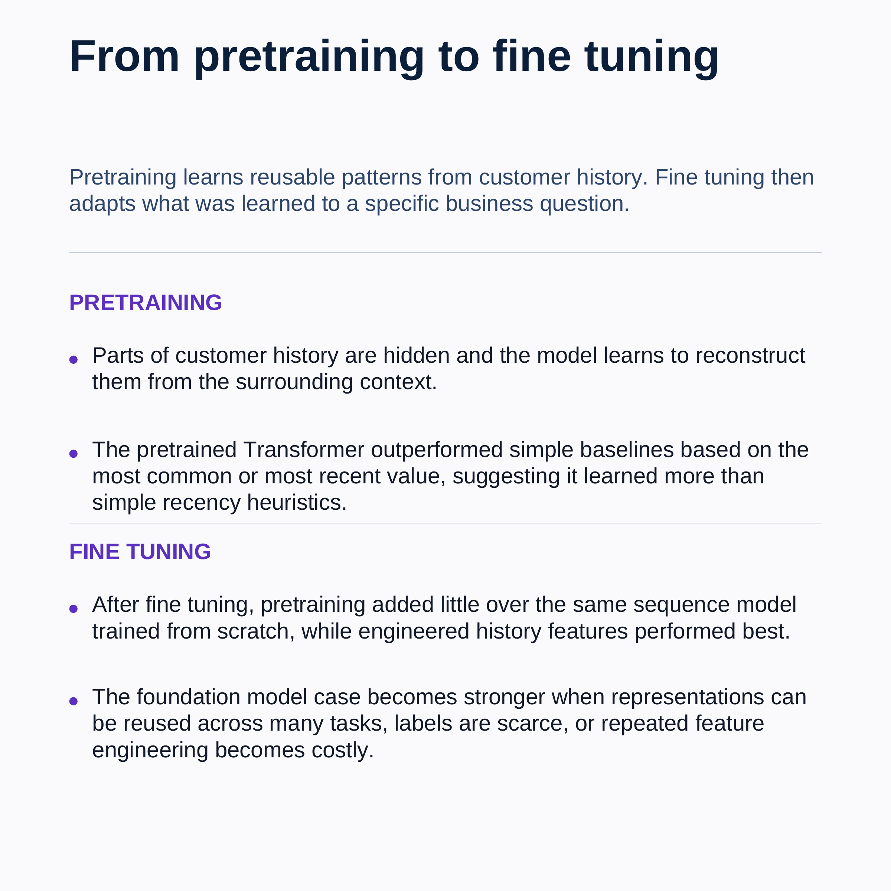

# Banking foundation model

[](https://colab.research.google.com/github/dimitrisdais/banking-foundation-model/blob/master/banking_foundation_model.ipynb)


What does it actually take to build a foundation model for banking behaviour?

The idea is appealing. Banks have long histories of payments, card transactions, transfers and other customer activity. Instead of engineering a separate representation for every use case, we can pretrain a model across customer histories and then specialise that representation for different business questions.

But there is a more basic question to answer first:

> **Do the data actually contain a sequence learning problem?**

A dataset can contain millions of transactions and still be a poor fit. If the target is already explained by a few fields in the current transaction, adding a sequence model may create complexity without adding useful information.

This repository explores that question end to end using two public synthetic banking datasets. It starts with the data, selects the stronger sequence learning setting, pretrains a small Transformer over customer histories, and then tests whether the learned representation helps on two downstream tasks.

[Read the LinkedIn post](https://lnkd.in/p/ejGTsTTa) · [View the full carousel](artifacts/banking_foundation_model_carousel.pdf)



## Start with the data

Before training a Transformer, I use three practical checks.

**Is there enough behavioural history?**  
There should be repeated customer activity over a meaningful period, not isolated events or snapshots.

**Are shortcuts dominating the target?**  
A simple rule or one current event field should not already explain most of the outcome.

**Does history add value?**  
Past behaviour should add information beyond the current event or a few simple summaries.

The point is not to create a universal score for whether a dataset is suitable. The point is to make the modelling decision explicit before investing in a more complex architecture.

## Two datasets, two very different situations

The first dataset is **SynSEPA**, a synthetic instant payment dataset with fraud labels.

It contains meaningful transaction histories, so history depth is not the problem. The issue is the target structure. In the sampled data, current transaction attributes already explain a large part of the fraud outcome. For example, non EU payments to a new beneficiary are always fraudulent in the sample, while payments to an existing beneficiary have effectively no fraud.

A simple current event model already reaches an average precision of **0.880**. Adding the supplied history field does not improve it.

The second dataset is the **IBM / Altman synthetic credit card dataset**.

Using transactions from 2014 onward gives more than 10 million events across 1,974 users. The median user has more than 5,000 transactions and the histories span several years. This gives us a much stronger setting for forward looking questions where past behaviour can plausibly matter.



The conclusion is simple.

**SynSEPA has history, but the sampled fraud task is dominated by current transaction shortcuts.**

**IBM / Altman provides deeper behavioural histories and supports forward looking targets where sequence context has a more meaningful role.**

So the rest of the experiment uses IBM / Altman.

## What the experiment tests

The model sees the customer's recent transaction history and learns a reusable behavioural representation.

Pretraining happens before either downstream task is introduced. Parts of the customer history are hidden and the Transformer learns to reconstruct them from the surrounding context.

The same backbone is then specialised for two business questions.

**Future category use**  
Will this customer use each of five broad merchant category groups in the next 30 days?

**Future activity tier**  
How active will this customer be in the next 30 days?

The public experiment uses a history window of 64 events and a Transformer with roughly 0.9 million parameters. Users are separated across training, validation and test sets so the same user does not appear on both sides of the evaluation.

## Compare against strong alternatives

A foundation model should not be evaluated in isolation.

The experiment compares four modelling strategies.

**Persistence**

Use recent behaviour as the reference point. This asks whether the latest behaviour is already enough.

**Engineered history features with gradient boosted trees**

Aggregate past behaviour into activity, amount and category features. This asks whether conventional feature engineering already captures the signal.

**Transformer trained from scratch**

Train the sequence model only on examples from the downstream task. This asks whether ordered customer history is useful without pretraining.

**Pretrained Transformer**

Start from the self supervised backbone and fine tune it on the downstream task. This asks whether pretraining improves the same sequence architecture.

## Did pretraining learn anything?

Before looking at the downstream tasks, we can test whether the self supervised objective learned more than simple heuristics.

At the end of pretraining, masked event reconstruction accuracy is approximately:

**Pretrained Transformer: 0.741**

**Copy the most recent value: 0.634**

**Predict the most common value: 0.521**



The pretrained Transformer therefore learns structure beyond simple frequency and recency rules.

## Downstream results

The two downstream tasks produce a deliberately mixed result.

For **future category use**, the engineered history model performs best with a macro mAP of **0.749**. The Transformer trained from scratch reaches **0.698**, while the pretrained and fine tuned Transformer reaches **0.690**. Persistence reaches **0.595**.

For **future activity tier**, the engineered history model again performs best with a macro mAP of **0.893**. This time the pretrained and fine tuned Transformer reaches **0.835**, ahead of the Transformer trained from scratch at **0.819**. Persistence reaches **0.701**.



So pretraining is not universally better.

It is slightly worse than scratch on the category task and better on the activity task. A well engineered gradient boosted model remains strongest on both individual benchmarks.

That is an important result rather than a failure of the experiment.

## What this says about foundation models for banking

The case for a banking foundation model is not that a Transformer should beat every conventional model on every task.

A conventional model may remain the right answer when the task is narrow, labels are plentiful, and historical features are straightforward to engineer.

The stronger argument for foundation style pretraining is **reuse**.

If the same behavioural representation can support many downstream questions, reduce repeated feature engineering, work when labels are scarce, or adapt more quickly to new tasks, then its value is not captured by a single benchmark score.

This experiment also shows why the dataset question comes first. Before asking whether pretraining helps, it is worth asking whether the underlying problem contains meaningful behavioural information that a sequence model can actually exploit.



## Run the experiment in Google Colab

The notebook is designed to run entirely in Colab.

First open `banking_foundation_model.ipynb` and select a GPU runtime.

Run the Google Drive mount cell and authorize access.

Run the data setup cells. SynSEPA is downloaded directly from Hugging Face. The IBM / Altman files are downloaded from Kaggle. The files are stored in:

```text
MyDrive/banking foundation model/
    data/
        synsepa/
        ibm/
    cache/
    outputs/
```

Run the verification cell before continuing. It confirms that the required files are available before any expensive processing begins.

Then continue through the dataset diagnostics, IBM benchmark construction, self supervised pretraining, the two downstream tasks, and the final comparison.

The notebook also saves the main figures to Google Drive so they can be reused outside the notebook.

## Repository structure

```text
banking foundation model/
    README.md
    banking_foundation_model.ipynb
    artifacts/
        foundation_model_process.png
        dataset_selection.png
        pretraining_diagnostics.png
        two_task_benchmark.png
        experiment_takeaways.png
        banking_foundation_model_carousel.pdf
```

## Data

The experiment uses two public synthetic datasets. The raw data are not redistributed in this repository.

**SynSEPA**  
EpiphanyTech SynSEPA on Hugging Face. The notebook downloads the transactions and accounts datasets directly.

**IBM / Altman synthetic credit card transactions**  
The public IBM synthetic credit card transaction dataset distributed by Erik Altman on Kaggle.

Both datasets are synthetic. The results should therefore be read as an experiment in modelling methodology, not as evidence of production banking performance.

## Scope

This is a small scale educational experiment.

The Transformer is intentionally small. The merchant category groups used for the first downstream task are coarse groups created for this experiment. Results depend on the data, target definitions, preprocessing choices and model configuration used here.

The public IBM benchmark is defined transparently inside the notebook from the downloadable raw data. It should be treated as the benchmark implemented by this repository, not as a reproduction of a proprietary production model.

The SynSEPA conclusion is also specific to the sampled fraud task used here. It shows that current transaction shortcuts make this target a weak setting for isolating the value of sequence learning. It is not a general judgement on the dataset.

## References

[LinkedIn post and discussion](https://lnkd.in/p/ejGTsTTa)

[Full visual carousel](artifacts/banking_foundation_model_carousel.pdf)

[SynSEPA on Hugging Face](https://huggingface.co/datasets/EpiphanyTech/SynSEPA)

[IBM / Altman synthetic credit card transactions on Kaggle](https://www.kaggle.com/datasets/ealtman2019/credit-card-transactions)
